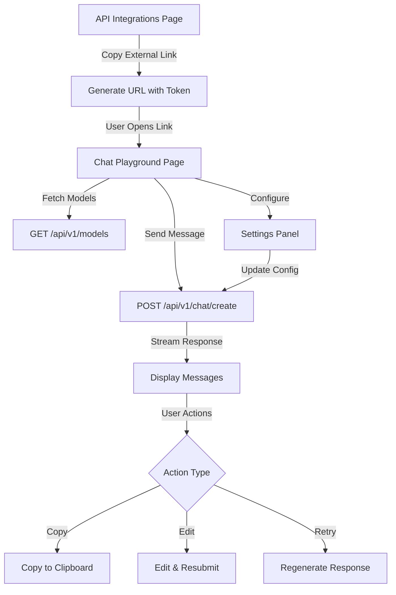
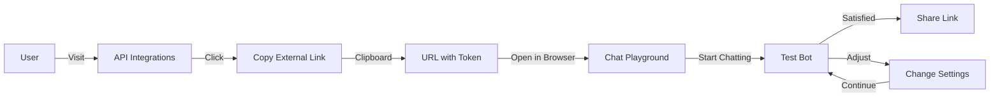
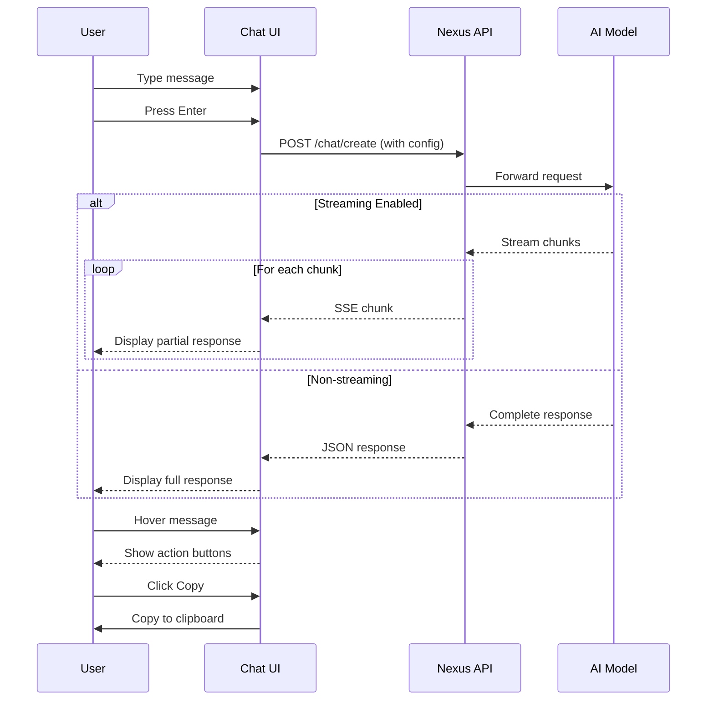
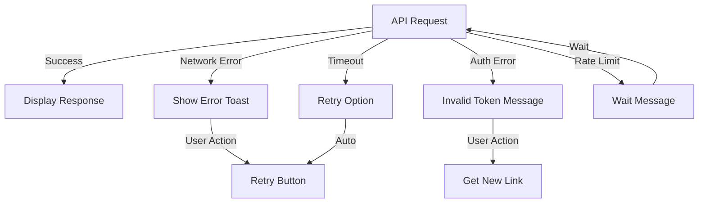

# Chat Playground - Architecture & Flow

## System Architecture



## User Flow



## Component Hierarchy

```
ChatPlayground (Main)
├── Left Sidebar (Desktop)
│   ├── Logo & Title
│   ├── New Chat Button
│   ├── Recent Chats List
│   └── Settings Button
│
├── Top Bar (Mobile)
│   ├── Logo
│   ├── New Chat Icon
│   └── Settings Icon
│
├── Messages Area
│   ├── Message Bubble (User)
│   │   ├── Content (Markdown)
│   │   ├── Timestamp
│   │   └── Actions
│   │       ├── Copy Button
│   │       └── Edit Button
│   │
│   └── Message Bubble (Assistant)
│       ├── Content (Markdown)
│       ├── Streaming Indicator
│       ├── Timestamp
│       └── Actions
│           ├── Copy Button
│           └── Retry Button
│
├── Input Area
│   ├── Selected Text Badge
│   ├── Textarea Input
│   └── Send/Stop Button
│
└── Settings Sheet
    ├── Model Selector
    ├── Max Tokens Slider
    ├── Temperature Slider
    ├── Cache Threshold Slider
    ├── Stream Toggle
    ├── Cache Toggle
    └── Config Preview (JSON)
```

## Data Flow



## State Management

```typescript
// Main State
{
  messages: Message[],          // Chat history
  input: string,                // Current input
  isLoading: boolean,           // Request in progress
  selectedText: string,         // Selected text for context
  editingMessageId: string,     // Currently editing message
  editedContent: string,        // Edited message content
  sidebarOpen: boolean,         // Mobile sidebar state
  abortController: AbortController, // Request cancellation
  
  config: {
    model: string,              // Selected model
    max_tokens: number,         // Response length
    temperature: number,        // Creativity (0-2)
    stream: boolean,            // Enable streaming
    cache_threshold: number,    // Similarity threshold
    is_cached: boolean          // Use caching
  }
}

// Message Structure
interface Message {
  id: string,                   // Unique identifier
  role: 'user' | 'assistant',   // Message sender
  content: string,              // Message text
  timestamp: Date,              // Send time
  isStreaming?: boolean         // Currently streaming
}
```

## API Integration Points

### 1. Model List Fetch
```
GET /api/v1/models
Headers: Authorization: Bearer {token}
Cache: 10 minutes
```

### 2. Chat Creation
```
POST /api/v1/chat/create
Headers: 
  - Authorization: Bearer {token}
  - Content-Type: application/json

Body: {
  model, messages, max_tokens,
  temperature, stream, cache_threshold, is_cached
}
```

### 3. Response Handling
```javascript
// Streaming
if (stream) {
  const reader = response.body.getReader();
  // Process SSE chunks
  // Update UI incrementally
}

// Non-streaming
else {
  const data = await response.json();
  // Display complete response
}
```

## Feature Matrix

| Feature | Desktop | Tablet | Mobile | Status |
|---------|---------|--------|--------|--------|
| **Chat Interface** | ✅ | ✅ | ✅ | Complete |
| **Streaming** | ✅ | ✅ | ✅ | Complete |
| **Message Actions** | ✅ | ✅ | ✅ | Complete |
| **Edit & Retry** | ✅ | ✅ | ✅ | Complete |
| **Text Selection** | ✅ | ✅ | ✅ | Complete |
| **Settings Panel** | ✅ | ✅ | ✅ | Complete |
| **Model Selection** | ✅ | ✅ | ✅ | Complete |
| **Responsive UI** | ✅ | ✅ | ✅ | Complete |
| **Chat History** | ❌ | ❌ | ❌ | Planned |
| **Export Chat** | ❌ | ❌ | ❌ | Planned |

## Responsive Breakpoints

```css
/* Mobile First Approach */

/* Mobile: < 768px */
- Full-width layout
- Top navigation bar
- Bottom sheet for settings
- Stacked messages

/* Tablet: 768px - 1023px */
- Collapsible sidebar
- Touch-optimized controls
- Adaptive message width

/* Desktop: 1024px+ */
- Permanent sidebar
- Wide chat area
- Full configuration panel
- Hover interactions
```

## Error Handling



## Performance Optimization

### Implemented:
- ✅ React Query caching for models
- ✅ Lazy message rendering
- ✅ Debounced input handling
- ✅ Optimized re-renders
- ✅ Efficient state updates

### Planned:
- 🔄 Virtual scrolling for long chats
- 🔄 Message pagination
- 🔄 Image lazy loading
- 🔄 Code splitting

## Security Layers

```
1. Token Authentication
   ├── URL parameter validation
   ├── Bearer token in headers
   └── Token expiration check

2. Request Validation
   ├── Input sanitization
   ├── Parameter validation
   └── Rate limiting (server-side)

3. Response Handling
   ├── XSS prevention
   ├── Content sanitization
   └── Error message sanitization
```

## Browser Compatibility

| Browser | Version | Support |
|---------|---------|---------|
| Chrome | 90+ | ✅ Full |
| Firefox | 88+ | ✅ Full |
| Safari | 14+ | ✅ Full |
| Edge | 90+ | ✅ Full |
| Mobile Safari | iOS 14+ | ✅ Full |
| Mobile Chrome | Latest | ✅ Full |

## Deployment Checklist

- [x] Create chat playground component
- [x] Add external link button
- [x] Implement streaming
- [x] Add message actions
- [x] Build settings panel
- [x] Make responsive
- [x] Add route to App.tsx
- [x] Create documentation
- [x] Test on mobile
- [x] Test on desktop
- [ ] Production deployment
- [ ] Monitor performance
- [ ] Gather user feedback

---

**Version**: 1.0.0  
**Architecture Date**: 2025-10-18  
**Next Review**: Q1 2026
